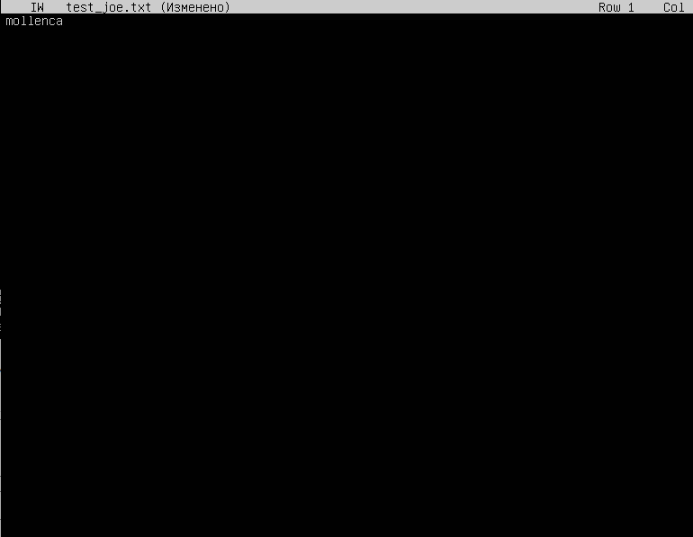
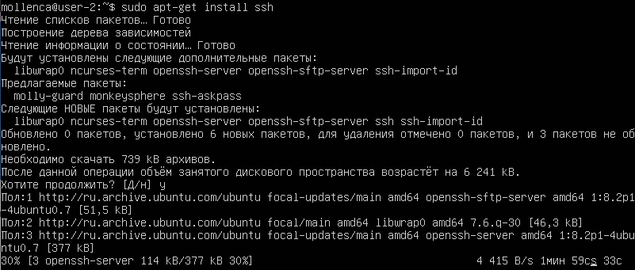
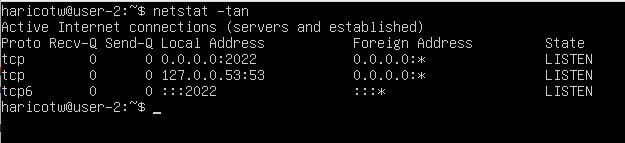

## Part 1. Установка ОС

 

## Part 2. Создание пользователя

- Создаю нового пользователя _school21_user_ с помощью команды `sudo adduser school21_user`

 

- Добавляю пользователя в группу adm: sudo usermod -a -G adm school21_user

 

- Вывожу на экран список пользователей

 

- Проверяю, что информация о пользователе _school21_user_ присутствует в выводе:

 

## Part 3. Настройка сети ОС

- Ввожу команду `sudo hostname user-1`, чтобы задать имя хоста, которое сохранится при перезапуске виртуальной машины

 

- Ввожу команду sudo timedatectl `set-timezone Europe/Moscow` и проверяю, что временная зона была изменена

 

- Вывожу названия сетевых интерфейсов в компактном виде ip -br link show

 

При выводе команды видно наличие интерфейса lo

**lo** (интерфейс loopback) — виртуальный интерфейс, который по умолчанию присутствует в любом Linux. Он используется сетевым клиентским программным обеспечением, чтобы общаться с серверным приложением, расположенным на том же компьютере. Наиболее широко используемый IP адрес в механизмах loopback — 127.0.0.1.

- Получили ip-адрес устройства от DHCP-сервера

 

Можно сделать вывод, что DHCP-сервер предложил используемому устройству адрес _10.0.2.0/24_, после чего он его использлование было подтверждено, и адрес закрепился за устройством.

**DHCP** (англ. Dynamic Host Configuration Protocol — протокол динамической настройки узла) — сетевой протокол, позволяющий сетевым устройствам автоматически получать IP-адрес и другие параметры, необходимые для работы в сети TCP/IP. 

- Вывожу внешний ip-адрес шлюза с помощью команды curl icanhazip.com

 

- Вывожу внутренний ip-адрес шлюза с помощью команд ip route | grep default или hostname -I

 

- Задаю статичные настройки ip, gw, dns.

- Для начала необходимо отключить облачную инициализацию. Для этого нужно открыть файл конфигурации subiquity-disable-cloudinit-networking.cfg в каталоге /etc/cloud/cloud.cfg.d/ с помощью команды:
sudo nano /etc/cloud/cloud.cfg.d/subiquity-disable-cloudinit-networking.cfg

- Проверяю, что network в положении disabled.

 

- Чтобы назначить статический IP-адрес в сетевом интерфейсе, открываю файл конфигурации YAML:
sudo nano /etc/netplan/00-installer-config.yaml

 

- Установливаю значение dhcp4 на no, чтобы отключить протокол DHCP, а также вручную задаю настройки ip, gw, dns

 

- Для применения внесенных изменений выполняю команду:

 

- Убеждаюсь,что сетевой интерфейс настроен на использование статического IP-адреса ip route show

 

- Перезапускаю виртуальную машину и проверяю, что файл с настройками не изменился

 

- Пингую удаленные хосты 1.1.1.1 и ya.ru

 

## Part 4

- Для обновления системынх пакетов использую команды _update_ для синхронизации индекса пакетов из репозиториев и _upgrade_  для установки самых новых версий пакетов, установленных в системе

 

 

- Проверяю, что сисетма была обновлена, повторно введя sudo apt-get upgrade, получаю сообщение об обновлении 0 пакетов

 

## Part 5

- Добавляю пользователя school21_user в группу sudo

 

- Меняю пользователя на schol21_user с помощью команды su, введя пароль, заданный в Part 2 при создании пользователя

 

- Меняю hostmame от лица пользователя school21_user

 

**sudo** (англ. Substitute User and do, дословно «подменить пользователя и выполнить») — программа для системного администрирования UNIX-систем, позволяющая делегировать те или иные привилегированные ресурсы пользователям с ведением протокола работы. Основная идея — дать пользователям как можно меньше прав, при этом достаточных для решения поставленных задач.

## Part 6. Установка и настройка службы времени

 

## Part 7. Установка и использование текстовых редакторов

- Устанавливаю недостающий редактор joe

 

- Записываю ник с помощью vim

 

- Для выхода с сохранением после нажатия esc ввожу :x

- Записываю ник с помощью nano

 

- Для выхода с сохранением пользуюсь ctrl+x

- Записываю ник с помощью joe

 

- Для выхода с сохранением пользуюсь ctrl+k+x

- Проверяю, что были созданы файлы, содержащие ник mollenca

 

- Изменяю test_vim.txt

 

- Для выхода без сохранения изменений после нажатия esc ввожу :q!

- Изменяю test_nano.txt

 

- Для выхода без сохранения изменений после ctrl+x при возникновении Save modified buffer?выбираю N

- Изменяю test_joe.txt

 

- Для выхода без сохранения изменений после ctrl+c при возникновении Отменить изменения файла?выбераю y

- Редактирую test_vim.txt еще раз, сохранив изменения. После найдем слово School

 

- Меняю Sch на P

 

- Выйхожу, сохранив изменения

- Редактирую test_nano.txt и сохраняю изменения. Ищу oo. Для этого пользуюсь ctrl+W

 

 

- В результате сообщается о количестве совпадений

- Меняю ool на edule. Для этого пользуюсь ctrl+\, ввожу заменяемое слово, нажимаю enter

 

- Ввожу слово для замены, нажимаю enter

 

- Подтверждаю замену, выбрав Y

 

- В резултате получаю новое слово, выхожу с сохранением

 

- Редактирую test_joe.txt и сохраняю изменения. Ищу School. Для этого использую сочетание ctrl+K+F

 

- Поскольку поиск осуществляется с начала блока (файла), нажимаю enter

 

- В результате курсор устанавливается на начало найденного слова

 

- Меняю все вхождения 21 на 42. Для этого пользуюсь ctrl+K+F, ввожу заменяемое слово, нажимаю enter

 

- Ввожу R для выбора операции замены, ввожу слово для замены, нажимаю enter

 

- Выбираю вариант заменить все с помощью R

 

- В резултате получаю две замены, выхожу с сохранением

 

Проверяю, что все изменения были сохранены

 

## Part 8. Установка и базовая настройка сервиса SSHD

- Устанавливаю SSH:

 
 

- Устанавливаю openssh (в данном случае сообщается о том, что openssh уже установлен)

 

- Проверяю, что автостарт службы при загрузке системы был добавлен. На это указывает enabled в Loaded

 

- Устанавливаю netstat, чтобы узнать, какие порты уже задействованы и не испольовать их повторно

 

- Выполняю sudo nano /etc/ssh/sshd_config

 

- Меняю Port на 2023 и выхожу, сохранив изменения. 

 

- Перезапускаю службу SSH, чтобы изменения вступили в силу: sudo systemctl restart ssh

- Проверяю, запущен ли ssh-домен на сервере с помощью команды ps

 

Команда **_ps_**, сокращенно от _Process Status_, представляет собой утилиту командной строки, которая используется для отображения или просмотра информации, связанной с процессами, запущенными в системе Linux.

**_a_** отображает идентификаторы процессов и состояние идентификатора сеанса для каждого реального пользователя.

**_u_** — это ширина экрана по умолчанию и формат виртуальной памяти с более ценными функциями, а также общая пользовательская настройка управления форматом вывода.

**_x_** предоставляет следующие столбцы: PID, TTY, STAT, TIME, COMMAND. Вывод «x» аналогичен выводу «u», но разница в том, что «x» отображает процессы, которые выполняются без привязки к какому-либо экрану терминала.

**_grep sshd_** выводит строки, содержащие _sshd_

- Выполняю reboot и netstat -tan

 

**_a_** выводит список всех портов и соединений независимо от их состояния или протокола

**_t_** выводит порты tcp

**_n_** показывает числовые адреса

**_tan_** выведет список всех портов TCP с с отображением адресов и номеров портов

- **Значения столблов:**

**_Proto_** — Протокол (tcp, udp, raw), используемый сокетом.

**_Reqv-Q_** — Счётчик байт не скопированных программой пользователя из этого сокета.

**_Send-Q_** — Счётчик байтов, не подтверждённых удалённым узлом.

**_Local Address_** — Адрес и номер порта локального конца сокета.

**_Foreign Address_** — Адрес и номер порта удалённого конца сокета. 

**_State_** — Состояние сокета. **_LISTEN_** — Сокет ожидает входящих подключений.

- **Значение 0.0.0.0.**

**_IP-адрес 0.0.0.0_** — это немаршрутизируемый адрес IPv4, который можно использовать в разных целях, в основном, в качестве адреса по умолчанию или адреса-заполнителя. Он действует как резервный, пока не будет назначен действительный маршрутизируемый IP-адрес.

## Part 9. Установка и использование утилит top, htop

- Устанавливаю htop sudo apt install htop
- Выполняю top

 

    - uptime: 3 минут
    - количество авторизованных пользователей: 1
    - общую загрузку системы: 0,27
    - общее количество процессов: 98
    - загрузку cpu: 0.0%
    - загрузку памяти: 147.6 из 1971.4
    - pid процесса занимающего больше всего памяти: 1
    - pid процесса, занимающего больше всего процессорного времени: 1273

- htop, отсортированный по PID

 

- htop, отсортированный по PERCENT_CPU

 

- htop, отсортированный по PERCENT_MEM

 

- htop, отсортированный по TIME

 

- htop, отфильтрованный для процесса sshd

 

- htop, с найденным с помощью поиска процессом syslog

 

- Добавленный вывод hostname, clock и uptime

 

## Part 10. Использование утилиты fdisk

 

- Название: VBOX HARDDISK
- Размер: 10 Гб
- Количество секторов: 20971520
- Размер swap: 0 байт

 

## Part 11. Part 11. Использование утилиты df

- Выполняю df

 

    - размер раздела: 8408452 Кб
    - размер занятого пространства: 4269320 Кб
    - размер свободного пространства: 3690416 Кб
    - процент использования: 54%

- Единица измерения: Кб (по умолчанию количество места на дисках выводится в килобайтах, если не указан какой-либо ключ)

- Выполняю df -Th

 

    - размер раздела: 8.1 Гб
    - размер занятого пространства: 4.1 Гб
    - размер свободного пространства: 3.6 Гб
    - процент использования: 54%

- Тип файловой системы для раздела: ext4 ((англ. fourth extended file system, ext4fs) — журналируемая файловая система)

## Part 12. Использование утилиты du

- Выполняю du

 

- Вывожу размер папок /home, /var, /var/log в человекочитаемом виде в байтах 

 

- Вывожу размер каждого вложенного элемента в /var/log

 

## Part 13. Установка и использование утилиты ncdu

- Устанавливаю ncdu

 

- Вывожу размер папки /home

 

- Вывожу размер папки /var

 

- Вывожу размер папки /var/log

 

## Part 14. Работа с системными журналами

- Открываю для просмотра /var/log/dmesg

 

- Открываю для просмотра /var/log/syslog

 

- Открываю для просмотра /var/log/auth.log

 

- Время последней успешной авторизации: 14:07:30
- Имя пользователя: mollencca
- Метод входа в систему: by uid = 0 (User Identifier). Суперпользователь всегда должен иметь UID, равный нулю.

- Перезапускаю службу SSHd: systemctl restart ssh

 

- Ищу в /var/log/auth.log сообщение о рестарте службы sshd

 

## Part 15. Использование планировщика заданий CRON

- Создаю файл расписания для текущего пользователя: crontab -e

 

- Просматриваю список текущих заданий для CRON

 

- Ищу в системном журнале строчки о выполнении uptime

 

- Удаляю все задания из планировщика и проверяю, что список заданий пуст 

 